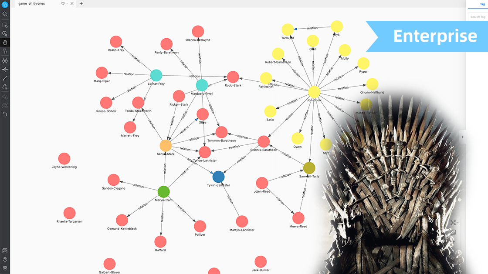
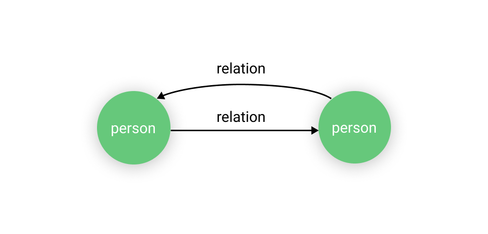
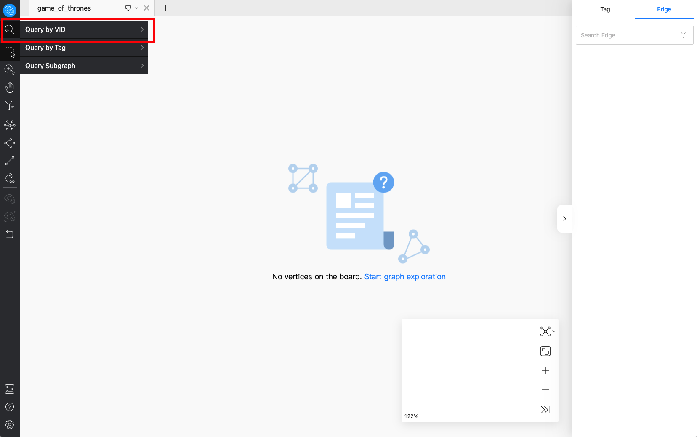
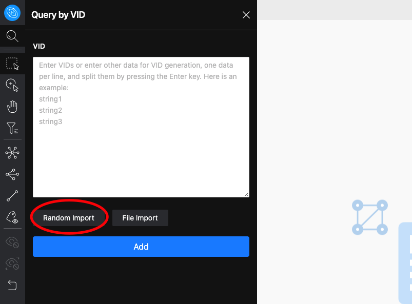
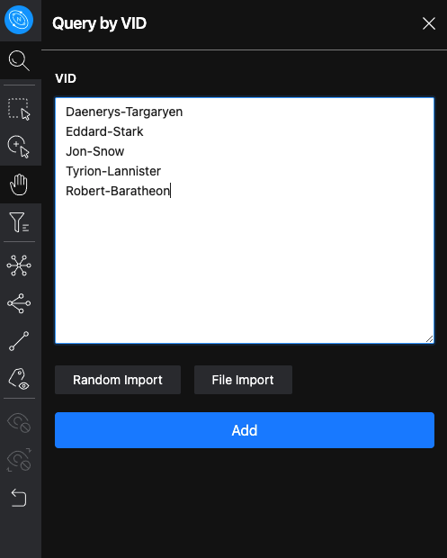
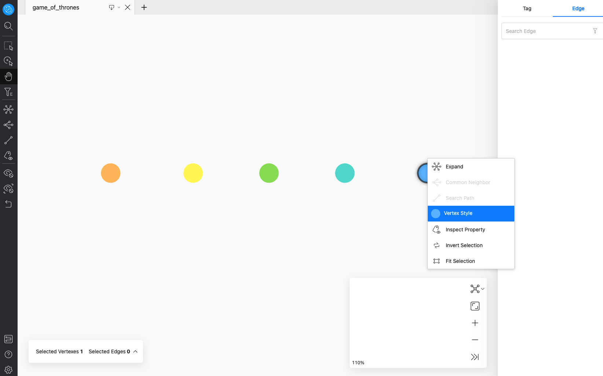
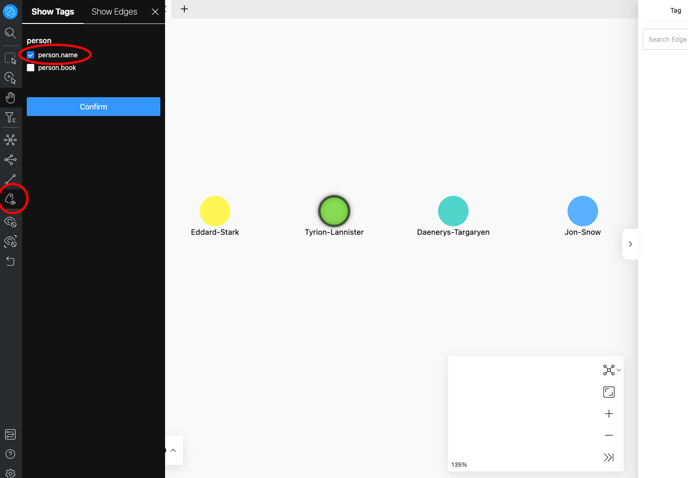
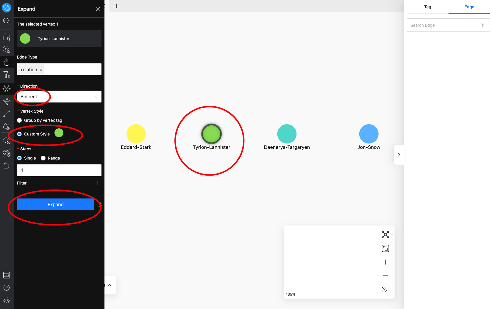
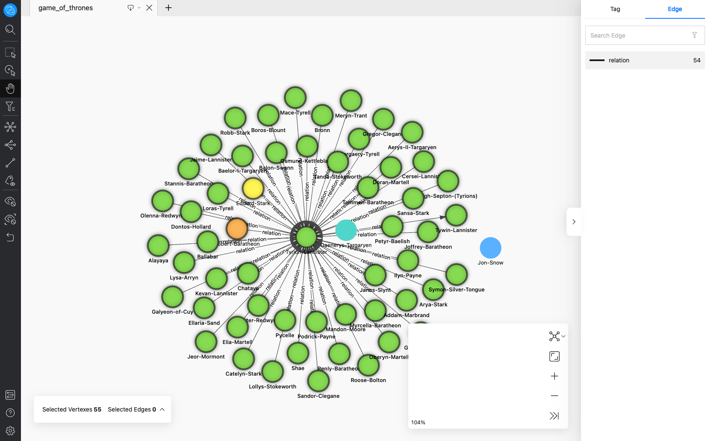
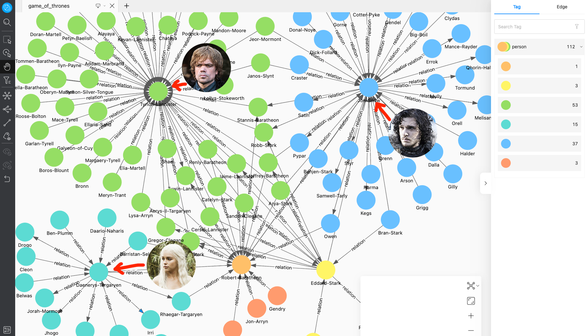

In this dataset, we will use the visual graph exploration tool Nebula Explorer to explore the publicly available data relationships in Game of Thrones.

## Quick start: 1.
1. Visit the Nebula Playground here: [Game_of_thrones](https://explorer.nebula-graph.io/explore?name_space=Game_of_thrones)

2. Click on the "magnifying glass" icon in the upper left corner and click on "Query by VID"

3. Click "Random Import" to import randomly, click "ADD" to add.

4. You can double-click them to expand them, or use the function bar on the left to do other operations.

## Details.
"Game of Thrones" is a TV series that everyone likes very much, and the wonderfully complex character relationships are a very good case study for exploring people and their relationships.

The traditional table format can not intuitively reflect the scale of the relationship, while the graph format can very easily reflect the complexity of the relationship, and quickly dig the relationship between the characters.

Complexity of this dataset: ★☆☆☆☆

The structure of this dataset, as shown in the figure:<br>
##### tag: person
##### edge: relation



Let's start exploring a few of the more key characters in the power trip

* Go to Nebula Explorer, click on the magnifying glass icon in the upper left corner, and then click on the "Query by VID" button.


* At this time, click the random import button in the pop-up box, and you can already explore the canvas.


* But in this step, we manually import some famous characters, copy the names below, and click "ADD" to add the points to the canvas.

```
Daenerys-Targaryen
Eddard-Stark
Jon-Snow
Tyrion-Lannister
Robert-Baratheon
```

 * At this point we can already see several red dots corresponding to the characters displayed in the canvas, so we right-click and modify the color of each dot individually for our subsequent analysis


 * On the left side, select the property display option, check person.name and click OK, so that the names of all points are displayed.


 * Here we select the middle imp Tyrion-Lannister, tap the left expansion panel, configure the parameters of the panel, here we select the direction as bidirectional, customize the color of the expansion, we select the same green color as the imp, then click the expand button.


 * At this point we can already see the character relationships associated with this point.


 * Similarly we can see the relationships of the female dragon lady, the male lead Jon-Snow, and the others.



 > #### This is a typical way of using graphs to quickly perform a character relationship lookup. Graphs have a huge advantage over the traditional table format in terms of associative relationships.

 We can learn in the results, who has richer interpersonal relationships, already which people are in which camps, the size of family relationships, etc.

 Dataset file: [Download address](https://github.com/yyh0808/game-of-thrones-dataset-nebula)

 Related article: [Analyzing ＜Game of Thrones＞ character relationships with NetworkX + Gephi + Nebula Graph](https://blog.csdn.net/weixin_44324814/article/details/108100159)
